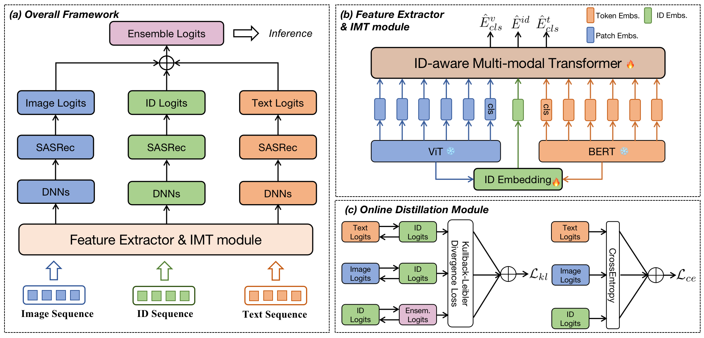

# 

# Online Distillation-enhanced Multi-modal Transformer for Sequential Recommendation (ACM MM 2023)
[Wei Ji*](https://jiwei0523.github.io/), [Xiangyan Liu*](https://openreview.net/profile?id=~Xiangyan_Liu1), [An Zhang](https://anzhang314.github.io/index.html), [Yinwei Wei](https://weiyinwei.github.io/), [Yongxin Ni](), [Xiang Wang](https://xiangwang1223.github.io/)

[`arXiv`](https://arxiv.org/pdf/2308.04067.pdf) | [`BibTeX`](#bibliography)

This repository is the official implementation for ACM MM 2023 paper (Oral) **Online Distillation-enhanced Multi-modal Transformer for Sequential Recommendation**. In this work:
- To relieve the incompatibility issue between multi-modal features and existing sequential recommendation models, we introduce the ODMT framework, which comprises an ID-aware Multi-modal Transformer module for item representation;

- To obtain robust predictions from multi-source input, we propose an online distillation training strategy in the prediction optimization stage, which marks the first instance of applying online distillation to a multi-modal recommendation task.

- Comprehensive experiments on four diverse multi-modal recommendation datasets and three popular backbones for sequential recommendation validate the effectiveness and transferability of our proposed method, which is about 10% performance improvement compared with other baseline models.
  
## Brief Introduction
The paper focuses on multi-modal recommendation systems, which integrate various types of information. While traditional collaborative filtering-based multi-modal recommendation systems have received significant attention, research on multi-modal sequential recommendation is still in its early stages. We investigate the importance of item representation learning and information fusion from heterogeneous data sources, and propose a new model-agnostic framework called "**Online Distillation-enhanced Multi-modal Transformer (ODMT)**" to enhance feature interaction and mutual learning among multi-source input (ID, text, and image) while improving recommendation accuracy. The framework includes an ID-aware Multi-modal Transformer module for information interaction and an online distillation training strategy to improve prediction robustness. Empirical experiments on video content and e-commerce recommendation datasets show that the proposed framework achieves approximately 10% performance improvement compared to baseline models.

<p align="center">

</p>

## News
[2023.11] We have released the code for our paper. However, the current code has not been thoroughly tested and may contain some unexpected issues. We will provide detailed explanations for the usage and dataset sections in the future.

[2023.10] Selected as an Oral at ACM MM 2023!

[2023.07] Accepted by ACM MM 2023!


## Bibliography
If you find this repository helpful for your project, please consider citing our work:

```
@inproceedings{ji2023online,
  title={Online distillation-enhanced multi-modal transformer for sequential recommendation},
  author={Ji, Wei and Liu, Xiangyan and Zhang, An and Wei, Yinwei and Ni, Yongxin and Wang, Xiang},
  booktitle={Proceedings of the 31st ACM International Conference on Multimedia},
  pages={955--965},
  year={2023}
}
```